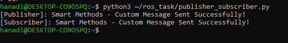
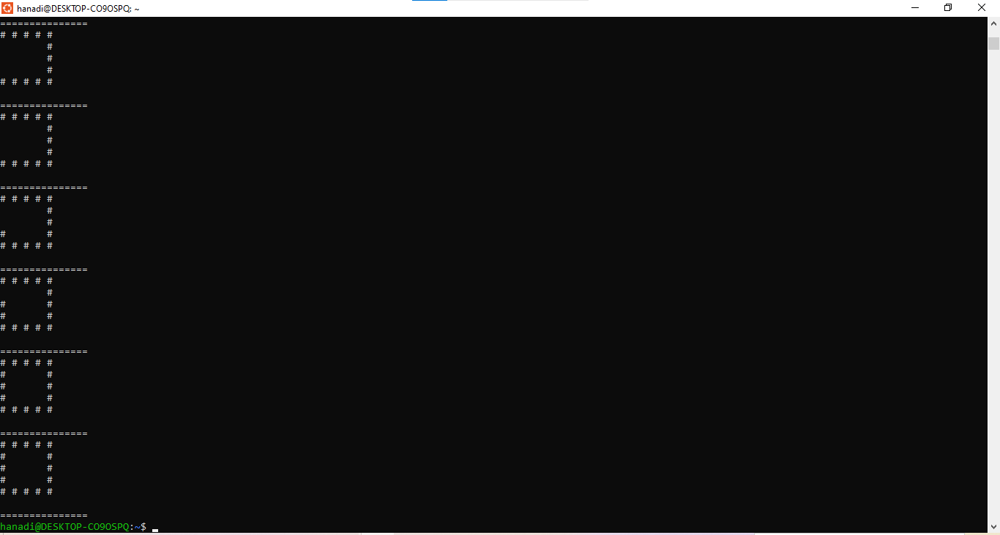

# Smart Methods - Task 5

مرحباً، هذا المستودع يضم حل المهمة الخامسة لمسار الأساليب الذكية (Smart Methods).

### الملفات:
* `publisher_subscriber.py` : كود يرسل ويستقبل رسالة مخصصة (Publisher & Subscriber).
* `turtle_square.py` : سكربت محاكاة حركة السلحفاة لرسم مسار مربع.

---

### إثبات النتائج (Screenshots):

**1. تجربة Publisher & Subscriber:**


**2. تجربة رسم المربع:**


---

### طريقة التشغيل في الترمينال:
```bash
python3 publisher_subscriber.py
python3 turtle_square.py
